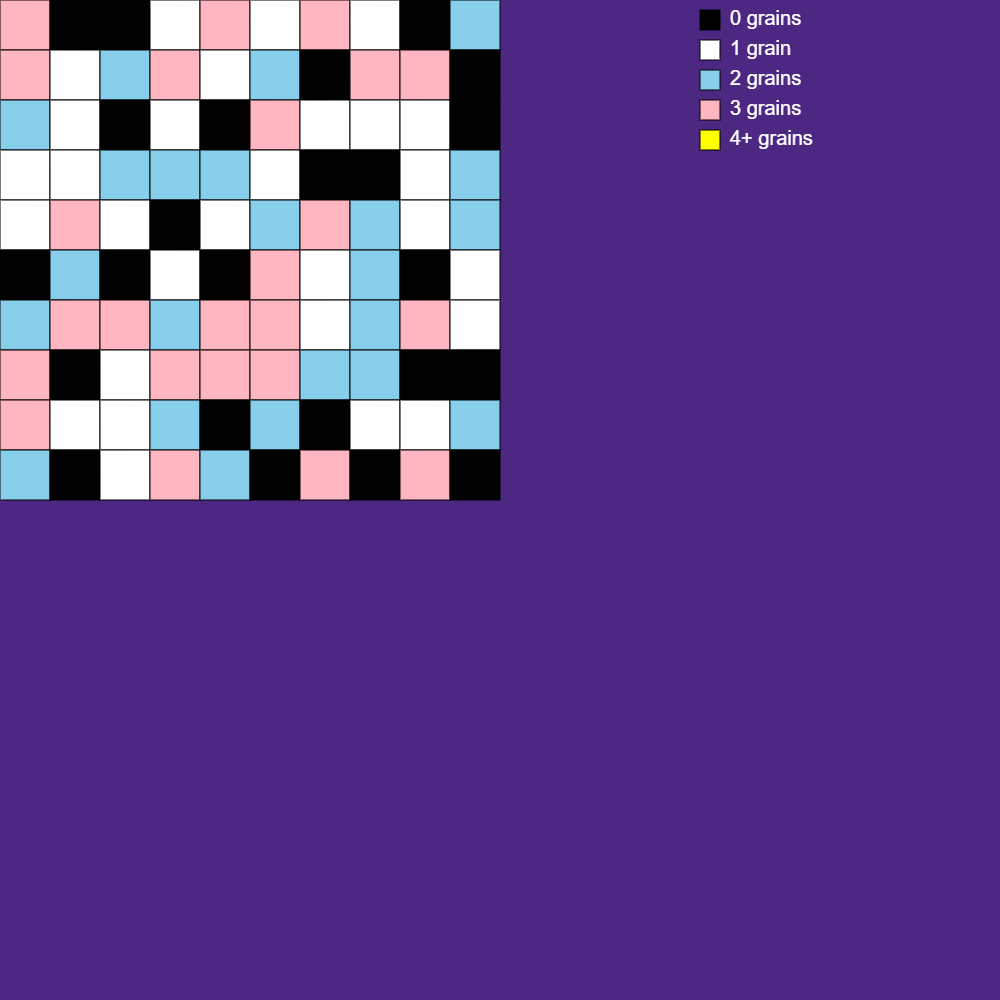
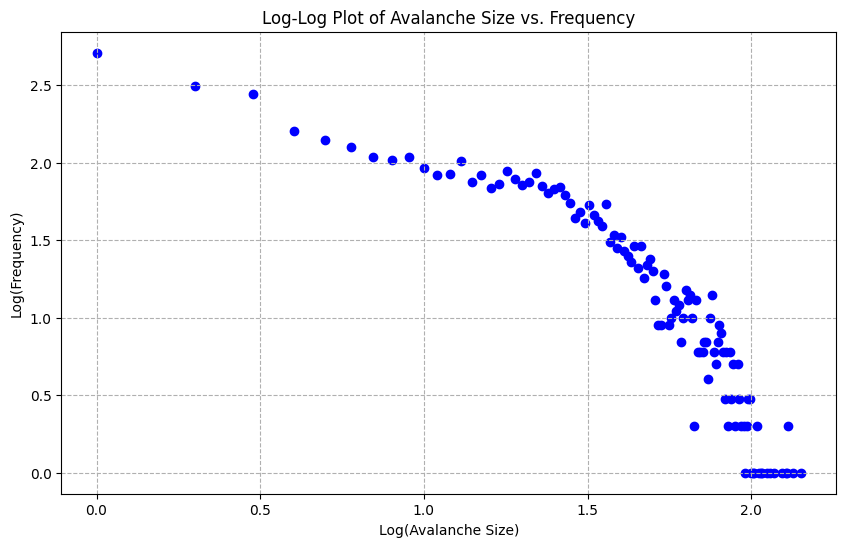
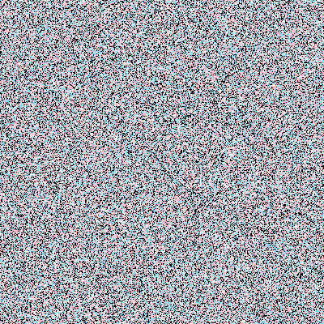
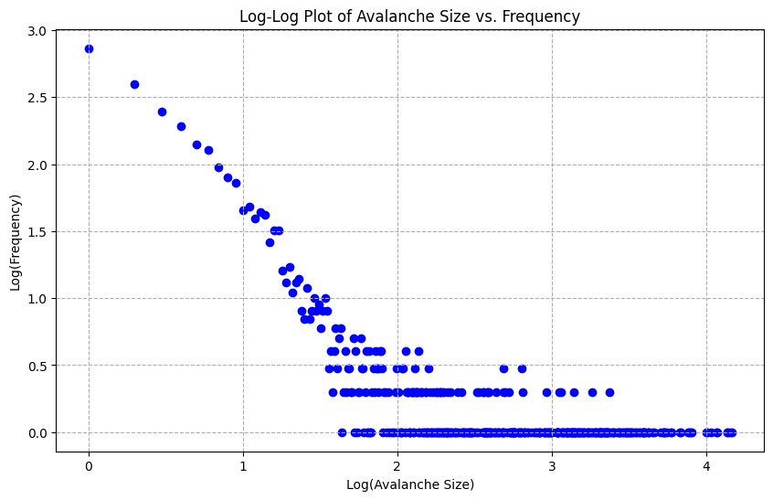

# Sandpile Simulations

This repository contains implementations of various sandpile models, demonstrating the concept of self-organized criticality written in JavaScript using the p5.js library for visualization.

This project shows the difference in the log-log plot that arises from the change in the grid size of the canvas. The plot changes significantly as the grid is increassed from 10x10 to 400x400 pixels.

## Table of Contents

1. [Basic Sandpile Model](#basic-sandpile-model)
2. [Larger Sandpile Model](#larger-sandpile-model)
3. [Abelian Sandpile Model](#abelian-sandpile-model)
4. [Installation and Usage](#installation-and-usage)

## Basic Sandpile Model

The basic sandpile model implements a simple 10x10 grid where each cell can contain grains of sand. This model demonstrates the fundamental concepts of self-organized criticality in a manageable scale.

### How it works:
- Each cell is initialized with a random number of grains (0-3).
- In each iteration, one grain is added to a particular cell.
- If a cell contains 4 or more grains, it "topples," distributing one grain to each of its four neighbors.
- The process continues until the system reaches a stable state.

### Visualization:

### Analysis:
The following log-log plot shows the distribution of avalanche sizes in the basic sandpile model:

This plot demonstrates the power-law distribution characteristic of self-organized criticality, where the frequency of avalanches decreases as their size increases, following a straight line to a certain extent on a log-log scale.

## Larger Sandpile Model

This sandpile model extends the basic model to a larger grid (400x400 pixels).

### Improvements:
- Random drop location in the canvas.
- Pixel-based rendering with larger grid size.
- GIF generation to visualize the evolution of the sandpile over time.

### Visualization:

### Analysis:
The log-log plot for the pixel model shows how the behavior scales with a larger grid:

This plot shows differences in the power-law distribution compared to the basic model due to the larger scale and random grain drop locations.

## Abelian Sandpile Model

The Abelian sandpile model demonstrates that the order of topplings doesn't affect the final state (hence "Abelian").

- A large initial pile (2^15 grains) placed at the center.
- Visualization of the resulting fractal-like patterns.

### Visualization:

## Installation and Usage

2. The following HTML files contain the respective simulations :
   - `basic_sandpile.html` for the Basic Sandpile Model
   - `sandpile_pixel.html` for the Sandpile Pixel Model
   - `abelian_sandpile.html` for the Abelian Sandpile Model
